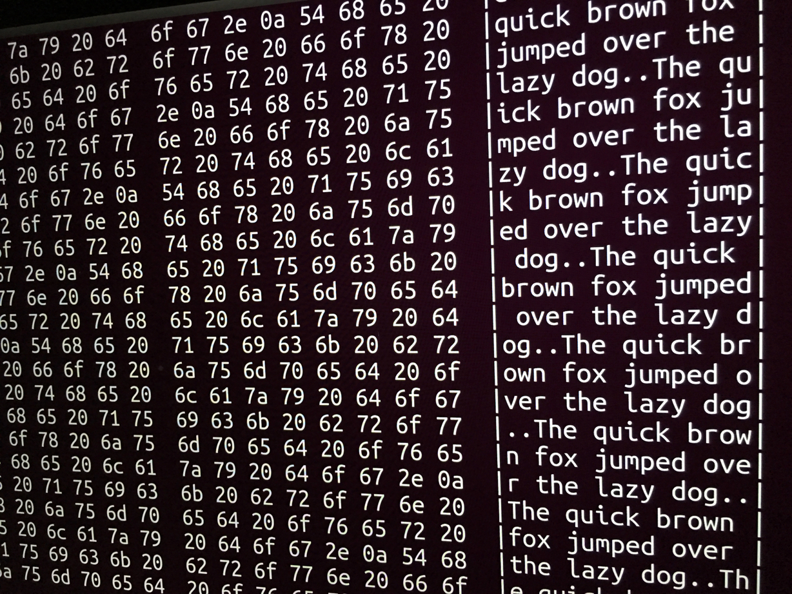
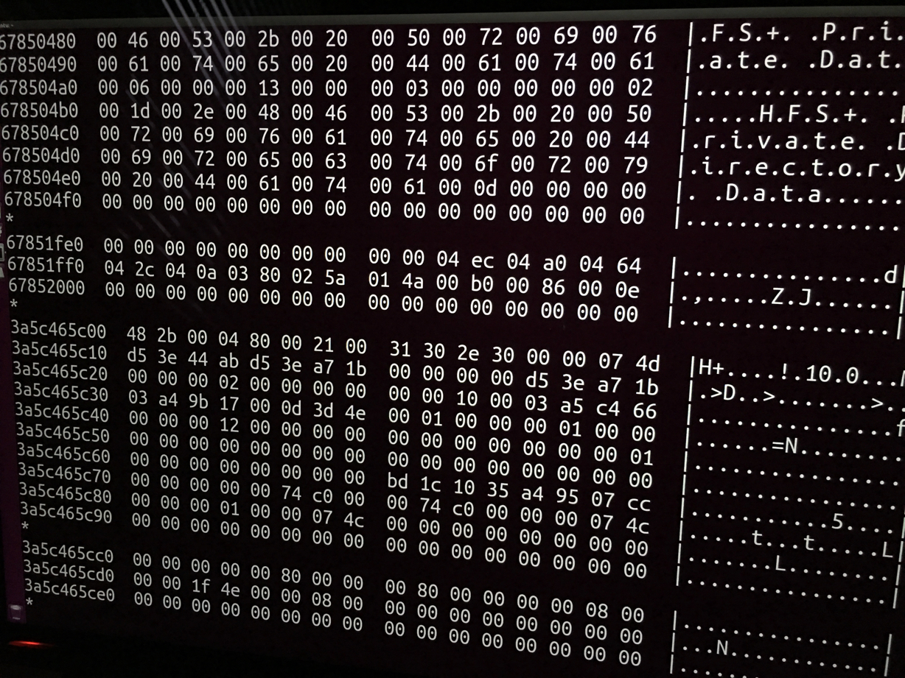

# Can the macOS Disk Utility really erase an SSD?

- date: 2017-04-11 00:00
- tags: macos, security
- canonical_url: https://spin.atomicobject.com/2017/06/13/macos-disk-utility-erase-ssd/

----

Laptop computers, especially those with a lot of internal storage, are very convenient. In the same amount of physical space that a magazine would take up, we can carry an amazing amount of data with us and work with it anywhere. One flip-side of that benefit is that all that data remains inside that computer even after we’ve moved on to a new one, unless we take steps to erase it first.

With older laptops featuring spinning magnetic hard disk drives, a lengthy, random erase process was the best way to go. But that’s not true for modern MacBooks with their solid state drives; Apple has even [removed the option](https://support.apple.com/en-us/HT201857). So how do we go about erasing these computers? And do those processes work?

_**Note:** Since this article was first posted, there has been some confusion about the setup used. I’m using a MacBook Pro with its built-in SSD. I’m also running Disk Utility directly on the MacBook itself, not over Target Disk Mode. This process has always been YMMV, but particularly if your setup is different than mine, expect variations._

The Best Way
------------

By far, the best way to keep your data secure is to [use full-disk encryption](https://spin.atomicobject.com/2017/02/06/security-hygiene/#use-full-disk-encryption), e.g. FileVault. Every bit of data you write to any disk after you’ve enabled FileVault on it is unreadable without the key, protecting it even if you lose the computer or it’s stolen.

Erasing the computer is now really easy, too. Everything on the computer is useless without the encryption key, so you simply need to erase the key itself. Since the key is cryptographically secured by your password, you just need to not sign into the computer—but you can also erase the encrypted key, too, with a simple disk erase.

But what if you didn’t use FileVault? Your disk is now full of data that could be sensitive. You’ll have to get rid of it somehow.

The Fallback Way
----------------

Apple recommends that, if you’re giving away or selling your Mac, you should simply erase it with Disk Utility first.

This advice puts people like myself, who have had long histories with hard drives and understand how they “delete” data—by leaving it around and just “losing track” of it—on high alert. If you just did a simple, quick erase on a hard drive ten years ago, any competent data recovery software would turn up a goldmine of data.

Erasing a disk the quick way in those days only put a new filesystem header on the front of the disk, like replacing the table of contents of a book with an empty one, but leaving the rest of the pages in the book intact. They did this for speed; overwriting all the data on a disk takes many hours. But it leaves a lot of data behind, which is why you’ll find plenty of articles advising how to use the macOS command line to force a hard-drive-style secure erase—where you overwrite it with random data many times—on a solid-state drive.

Thankfully, there’s a way that you can have a modern hard drive—old-style spinning or solid-state—erased very quickly, _and_ securely. It’s a close cousin to full-disk encryption, and it’s called a [secure erase](https://en.wikipedia.org/wiki/Write_amplification#Secure_erase).

A new drive that’s capable of secure erase has a random encryption key generated for it on day one. That key is kept on the drive, and all data written to it is encrypted with that key. When a secure erase is requested, that key is destroyed, leaving all the encrypted data unreadable.

Apple, being Apple, isn’t telling us (at least, not anywhere I can find) if their Disk Utility erase process is actually a secure erase. I decided to look into whether a Disk Utility erase does leave easy-to-read breadcrumbs behind, or whether it cleans up after itself.

Creating Some Data to Find
--------------------------

A disk—any disk—is basically a giant file, the size of the entire disk. The easiest way to look for data to be recovered on a disused disk is to scan it, beginning to end, and look for patterns that indicate useful data.

The first thing I needed to do to test this out was fill a disk with data I could easily find again. To do this, I took the Ann Arbor office loaner MacBook—recently erased from its last borrower—and half-filled its disk with a bunch of files.

(Warning: if you do this, you’re going fill your disk with junk—25,000 copies of a 4.6 megabyte file containing 100,000 copies of the phrase “The quick brown fox jumped over the lazy dog.”—enough to fill half a 256 gigabyte SSD, which was my goal.)

```bash
$ for n in `seq 100000`
> do
>   echo 'The quick brown fox jumped over the lazy dog.'
> done >template.txt
$ for n in `seq 25000`
> do
>   cp template.txt template_$n.txt
> done
```

That done, I verified that the disk space was actually taken up.

Now, to inspect the raw disk, I had to reboot; macOS doesn’t allow access to the raw disk device with standard Unix tools, even if you’re `root`. I also found out the macOS recovery partition didn’t have the tools I needed, so I booted [Ubuntu](https://www.ubuntu.com/download/desktop) instead.

Once in, the incantation to scan the disk—this will read the entire disk in 1 megabyte chunks, and pass it through a hex dump tool that we can use to visually inspect the data:

```bash
# dd if=/dev/sda2 bs=1024k | hexdump -C
```

And a large portion of the output—which I stopped, because it would take far too long to visually read the whole disk—looked like this:



Erase and Aftermath
-------------------

If I were to do a naïve erase of this disk by writing just a new filesystem header to the beginning, like most old-school disk erases did, the vast majority of this data would still be fully readable.

But I wasn’t planning on doing an old-school disk erase. My next step was to reboot into the macOS recovery partition and erase the disk with Disk Utility like Apple advises.

I didn’t bother reinstalling macOS into the newly-erased drive. It might overwrite some of the data if it hadn’t been completely erased, but it certainly wouldn’t overwrite all of it regardless. Opting to skip the install step entirely gave me the greatest chance to find any trace of the data.

Once erased, I rebooted into Ubuntu one more time, and ran the same command. The output was _much_ shorter this time—I let it run to the end, seeing no trace of my data, but just this:



The middle is where our data would’ve been—it’s over 250 gigabytes of zeroes. Apple’s recommended erase procedure has, in the space of a few seconds, replaced all our old data with a big empty expanse of nothing.

Conclusion and Caveats
----------------------

So what does this mean? This is exactly what I’d expect to see if Apple had, in fact, implemented a secure erase with Disk Utility, like we suspected. It means that whatever data you had before the erase is inaccessible to just about anyone who acquires your computer, which is great news for anyone who might want to grab a copy of [Disk Drill](https://www.cleverfiles.com/) and start digging.

It doesn’t mean that data is guaranteed to be gone, however. Unless we have evidence that Apple actually is secure-erasing the drive, there are processes by which more well-resourced adversaries could recover data—for example, if they were simply marking every part of the drive as “free”, it’s possible someone could convince the SSD to give up that data once again.

Given this, your safest bet is still to always use full-disk encryption on any MacBook. However, I think it’s reasonable to assume that unless your threat model includes adversaries who will spare no expense to recover your data, if you haven’t used FileVault, you don’t need to be anxious that data you wrote in the past to this computer is a problem.

My recommendation is this: use FileVault going forward, and make sure you give your computer a regular erase before you give it up.

_This article originally appeared [on Atomic Spin](https://spin.atomicobject.com/2017/06/13/macos-disk-utility-erase-ssd/)._

